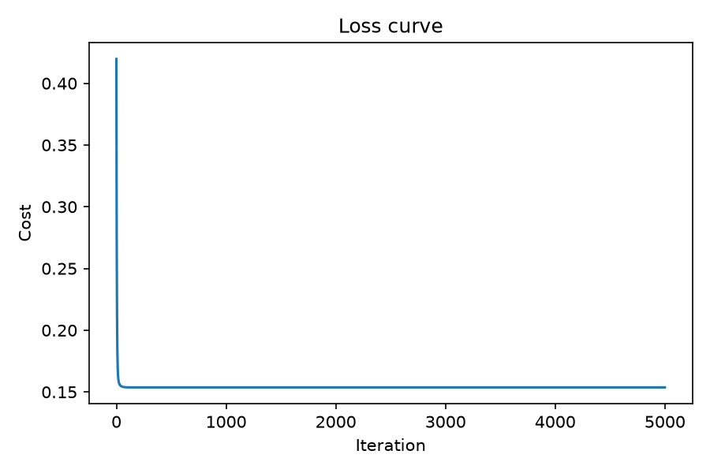
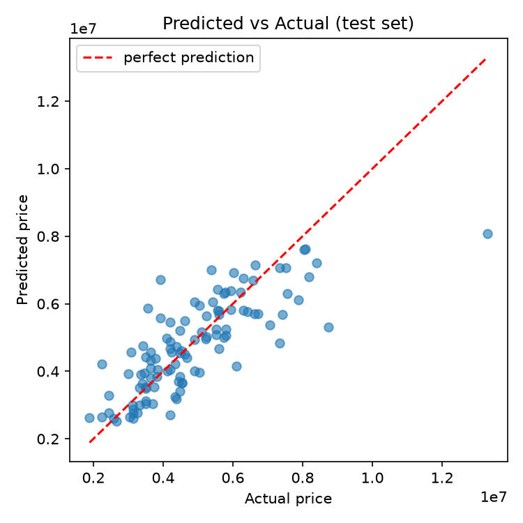

# Linear Regression from Scratch (NumPy only)

[](https://www.kaggle.com/code/ahmedshanaa/notebookc0cdc703ef)

Multivariate linear regression trained with **gradient descent**, implemented with only NumPy, then checked against the Normal Equation and scikit-learn. Applied to a house price dataset.



## What this project shows

- Cost function, gradient and gradient descent written by hand (vectorized, no loops over samples)
- Feature standardization, and converting the learned weights back to the original units
- Train/test split with a fixed seed, evaluated with RMSE and R²
- Validation: the result matches the Normal Equation (and scikit-learn, when installed)

## The math

Model:

$$f_{w,b}(x) = w \cdot x + b$$

Cost (mean squared error):

$$J(w,b) = \frac{1}{2m} \sum_{i=1}^{m} \left( f_{w,b}(x^{(i)}) - y^{(i)} \right)^2$$

Gradients:

$$\frac{\partial J}{\partial w_j} = \frac{1}{m} \sum_{i=1}^{m} \left( f_{w,b}(x^{(i)}) - y^{(i)} \right) x_j^{(i)}, \qquad \frac{\partial J}{\partial b} = \frac{1}{m} \sum_{i=1}^{m} \left( f_{w,b}(x^{(i)}) - y^{(i)} \right)$$

Update rule (repeated until the cost stops decreasing):

$$w_j := w_j - \alpha \frac{\partial J}{\partial w_j}, \qquad b := b - \alpha \frac{\partial J}{\partial b}$$

Features and target are standardized before training, which lets gradient descent converge quickly with a single learning rate. The learned weights are then converted back to the original scale so they can be read directly (for example, price change per extra square meter).

## Results

Test set (20% of the data, never seen during training):

| Method | RMSE | R² |
|---|---|---|
| Gradient Descent (this project) | 1,067,598 | 0.6179 |
| Normal Equation | 1,067,598 | 0.6179 |

Gradient descent reaches the same solution as the closed-form Normal Equation, which confirms the implementation is correct. If scikit-learn is installed, the script also prints its result for comparison.

An R² of about 0.62 is expected for a purely linear model on this dataset: it explains a good part of the price variation, but not all of it.



## Quick start

1. Download [`Housing.csv`](https://github.com/UmairPirzada/Linear-Regression-Model-for-House-Price-Prediction/blob/main/Housing.csv) (house price dataset) and put it next to `linear_regression.py`.
2. Install and run:

```bash
pip install -r requirements.txt
python linear_regression.py
```

The script prints the metrics and the learned weights, saves the plots in `images/`, and predicts the price of a new house. To try your own values, edit the `new_house` dictionary at the end of the file.

## Project structure

```
.
├── linear_regression.py   # algorithm, training, evaluation, plots, prediction
├── images/                # plots generated by the script
├── requirements.txt
├── LICENSE
└── README.md
```

## Notes and limitations

- It is a linear model, so it cannot capture non-linear relationships (for example, a log transform of `area` could help).
- Predictions far outside the range of the training data are unreliable.
- The cost can flatten before the weights have fully converged, so a generous number of iterations is used.

## License

MIT. See [LICENSE](LICENSE).

## Author

Ahmed Shanaa

<!-- TODO: add your LinkedIn / GitHub profile links here -->
